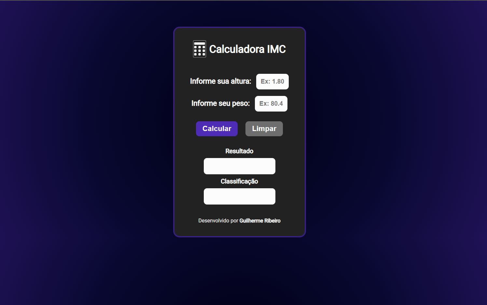

<h2 align="center">Calculadora de IMC</h2>

<h3>Funcionalidades</h3>

Calcular o Índice de Massa Corporal do usuário e divulgar o resultado e a classificação.

Para visualizar o projeto, <a href="https://guilhermeribeir0.github.io/Calculadora-IMC/">clique aqui</a>

<h3>Tecnologias Utilizadas</h3>

<ul>
    <li>HTML</li>
    <li>CSS</li>
    <li>JavaScript</li>
</ul>
